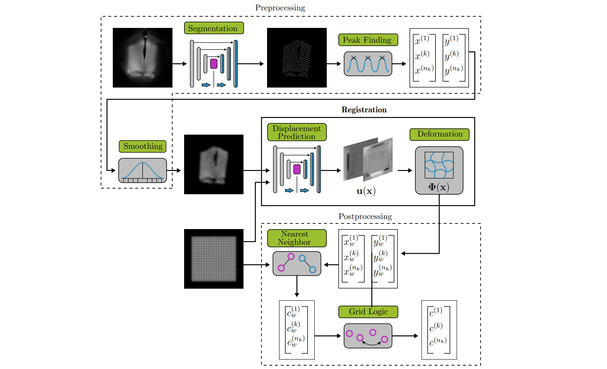

# Feature-based image registration in structured light endoscopy


This repository named endolas contains a deep learning-based image registration for structured light endoscopy. The method was developed with the use of laryngeal recordings to classify keypoints that are projected by a laser (features). Therefore the name endolas is a composition of the words endoscope and laser. The approach contains a preprocessing step in which a semantic segmentation is performed to localize keypoints. The image registration is then performed to transform the irregularly placed keypoints into a regularly placed grid. In a postprocessing step, a nearest neighbor approach and a sorting algorithm are used to classifiy individual keypoints. The implementation resides in the package [**endolas**](./endolas) and demonstration is provided in [**demo**](./demo). Further, the dataset LASTEN, which was used for training and evaluation, is given in [**data**](./data).

## Installation

1) Download the repository.
2) Activate your desired python environment containing at least Python 3.7. 
3) Within the repository, run the setup.py with:

```
pip install . 
```

The package **endolas** will now be installed in your environment including resources and additionally required packages.

## Demo

* To perform the registration including pre- and postprocessing, please see the [**registration.ipynb**](./demo/registration.ipynb) example in the demonstration. The method uses several modules as shown in the figure below.
  

* Data can be synthetically generated or augmented with the help of the script [**synthesis.ipynb**](./demo/synthesis.ipynb).

* The deep neural network of the registration can be trained with the aid of [**training.ipynb**](./demo/training.ipynb).

* To understand how the loss of the registration is computed, the [**LISTING_custom_loss.py**](./demo/LISTING_custom_loss.py) shows details about the implementation. Further the nearest neighbor and sorting algorithm, which are required in the postprocessing, are provided in [**LISTING_nearest_neighbor.py**](./demo/LISTING_nearest_neighbor.py) and [**LISTING_bubble_sort.py**](./demo/LISTING_bubble_sort.py).
